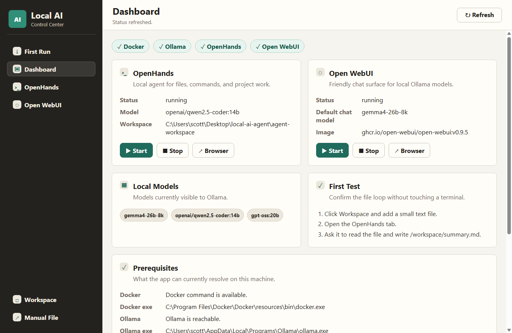

# Local AI Control Center

Local AI Control Center is a Windows-friendly desktop app for running and managing your local Ollama-powered agent stack without using a terminal.

It is Windows-only for now and binds local service ports to `127.0.0.1` so OpenHands and Open WebUI are not intentionally exposed to your local network.

It gives you one GUI for:

- Running a first-run setup wizard.
- Reading the machine's CPU, RAM, disk, GPU, and VRAM.
- Installing Docker Desktop and Ollama from the app when possible.
- Pulling required Ollama models and Docker images.
- Starting and stopping OpenHands.
- Starting and stopping Open WebUI.
- Checking Docker, Ollama, and service health.
- Opening the writable agent workspace.
- Opening the user manual.
- Embedding the OpenHands and Open WebUI interfaces in one place.



## Start The App

Download the latest portable Windows release, then open the app. On first launch, start with the **First Run** tab.

The first-run wizard checks whether the machine can comfortably run the stack. For the recommended OpenHands-ready local models, plan on:

- Windows 10/11.
- NVIDIA GPU with roughly 16 GB VRAM available.
- 32 GB system RAM.
- 80 GB free disk space.
- Internet access for first-time downloads.

From the source app folder, double-click the no-terminal launcher:

```text
Launch Local AI Control Center.vbs
```

If you want to see startup logs, double-click:

```text
Start Local AI Control Center.cmd
```

First-time setup:

```text
Install Local AI Control Center.cmd
```

That source setup helper installs Node dependencies and builds the app. End users who download the release EXE should use the in-app **First Run** wizard instead.

## User Manual

Full walkthrough:

```text
USER_MANUAL.md
```

## Marketing Landing Page

Static landing page:

```text
landing\index.html
```

The page is intentionally honest about the current product state: useful local Windows control center today, still being hardened for wider distribution.

## Local Services

OpenHands runs at `http://localhost:3000`.

Open WebUI runs at `http://localhost:8080`.

Ollama runs at `http://127.0.0.1:11434`.

Docker is resolved from `DOCKER_EXE`, `DOCKER_PATH`, the system `PATH`, or the standard Docker Desktop install location.

The setup wizard can install Docker Desktop and Ollama through `winget` when Windows has it available. If `winget` is missing, the app opens the official download page so the user can install the missing tool without using a terminal.

## OpenHands

OpenHands is the local coding/agent UI. It can work in a Docker sandbox, read and write project files, and run commands.

Writable local workspace:

```text
.\agent-workspace
```

Inside OpenHands, that folder appears as:

```text
/workspace
```

Start it:

```powershell
.\start-openhands.ps1
```

Then open:

```text
http://localhost:3000
```

Recommended first settings for agent/file work:

```text
LLM Provider: OpenAI-compatible
Model: openai/qwen2.5-coder:14b
Base URL: http://host.docker.internal:11434/v1
API Key: local-key
```

Gemma is still available for fast local chat:

```text
gemma4-26b-8k
```

## Open WebUI

Open WebUI is a friendly local chat interface for Ollama.

Start it:

```powershell
.\start-openwebui.ps1
```

Then open:

```text
http://localhost:8080
```

## Development

Developer setup, packaging, and maintainer commands live in:

```text
DEVELOPER.md
```

Install dependencies:

```powershell
npm install
```

Run the desktop app in development mode:

```powershell
npm run dev
```

Run the test runner:

```powershell
npm run test:runner
```

Run build/unit checks without requiring local services:

```powershell
npm run test:unit
```

Optional local LLM smoke test:

```powershell
npm run test:llm
```

## Local Runner

Use the local runner before publishing or packaging changes.

Use the local runner first:

```text
Run Local Test Runner.vbs
```

See:

```text
RUNNER.md
```
